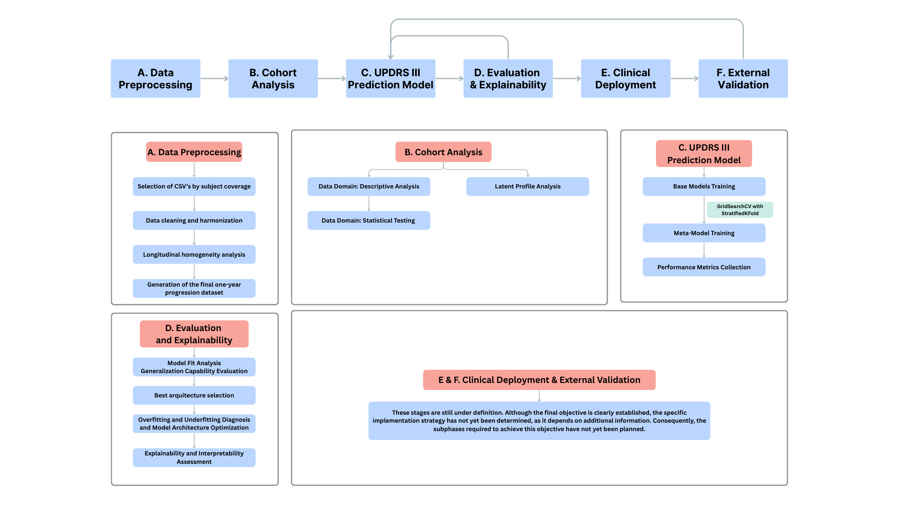

# 📊 UPDRS III Progression Prediction Project

## 📌 Project Overview

This project aims to develop a **data-driven framework** to predict **one-year progression of UPDRS III scores** using longitudinal clinical data. The pipeline integrates **data preprocessing**, **cohort characterization**, **machine learning modeling**, **model evaluation with explainability**, and prepares the groundwork for **clinical deployment and external validation**.

The workflow follows a **modular and reproducible design**, aligned with translational research standards and future clinical applicability.

---

## 🧩 Project Pipeline Overview

The project workflow is structured into **six sequential and interconnected stages (A–F)**, covering the full lifecycle from raw data to clinical translation.

---

## 🅰️ A. Data Preprocessing

This stage ensures **data quality, consistency, and longitudinal reliability** across all subjects and visits.

### Key Steps
- Selection of CSV files based on subject coverage
- Data cleaning and harmonization
- Longitudinal homogeneity analysis
- Generation of the final one-year progression dataset

### Output
📤 Clean, harmonized dataset ready for cohort analysis and modeling.

---

## 🅱️ B. Cohort Analysis

This stage focuses on **understanding the clinical data domain** and identifying meaningful patient subgroups.

### Key Steps
- Descriptive analysis of clinical and demographic variables
- Statistical testing across relevant domains
- Latent Profile Analysis to identify hidden patient phenotypes

### Output
📊 Cohort-level insights and patient stratification knowledge.

---

## 🅲 C. UPDRS III Prediction Model

Machine learning models are trained to predict **one-year UPDRS III progression**.

### Key Steps
- Training of base machine learning models
- Hyperparameter tuning using `GridSearchCV` with `Stratified K-Fold` cross-validation
- Meta-model training (ensemble and/or stacked models)
- Collection of performance metrics

### Output
🤖 Trained predictive models with validated performance.

---

## 🅳 D. Evaluation and Explainability

This stage ensures **model robustness, generalization, and interpretability**, which are critical for clinical relevance and trust.

### Key Steps
- Model fit analysis and generalization capability evaluation
- Best architecture selection
- Overfitting and underfitting diagnosis
- Model architecture optimization
- Explainability and interpretability assessment

### Output
🔍 Optimized, interpretable, and clinically meaningful predictive model.

---

## 🅴 E. Clinical Deployment *(Under Definition)*

🚧 This stage is currently under definition.

The objective is to enable **clinical usage** of the selected predictive model. The final implementation strategy will depend on additional **clinical, regulatory, and technical constraints**, including integration into clinical workflows, usability, and decision-support requirements.

---

## 🅵 F. External Validation *(Under Definition)*

🚧 This phase is currently under definition.

The goal is to validate the model on **independent external datasets** to assess **real-world generalization, robustness, and transferability** beyond the development cohort.

---

## 🎯 Project Goals

- Predict one-year UPDRS III progression using longitudinal clinical data
- Identify clinically meaningful patient subgroups
- Ensure model robustness, interpretability, and explainability
- Prepare the framework for clinical translation and external validation

